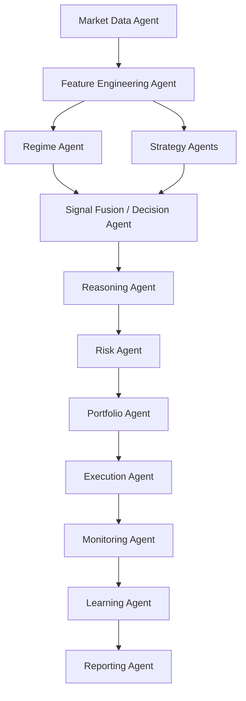

# Agent Network

Sopotek works best as a controlled network of specialized agents, not as one large trading brain. The practical shape for this repo is a layered, event-driven hierarchy where symbol-level agents publish structured outputs and only the control layers are allowed to turn those outputs into orders.

## Recommended Layers



## Agent Roles

- `Market Data Agent`: publishes normalized ticks, candles, order-book snapshots, and venue state. It never trades.
- `Feature Engineering Agent`: converts raw market updates into indicators, volatility measures, and ML-ready feature vectors.
- `Strategy Agents`: emit structured `BUY`, `SELL`, or `HOLD` proposals with confidence, reasons, and expected holding windows.
- `Regime Agent`: labels the current market state so the system can favor or mute strategies by context.
- `Signal Fusion / Decision Agent`: merges strategy votes, applies regime compatibility, decays stale opinions, and emits one trade intent.
- `Reasoning Agent`: explains the decision, highlights contradictions, and can reduce confidence or veto weak setups.
- `Risk Agent`: enforces hard limits on size, drawdown, leverage, and stop placement.
- `Portfolio Agent`: checks cross-symbol concentration and correlated exposure before a new trade proceeds.
- `Execution Agent`: translates approved trade intents into broker-specific orders and tracks acknowledgements.
- `Monitoring Agent`: watches fills, slippage, stop or target logic, stale positions, and broker-state health.
- `Learning Agent`: records outcomes, scores agent performance by regime, and updates weights slowly and safely.
- `Reporting Agent`: turns system state into operator-facing dashboard, Telegram, and post-trade summaries.

## Event Flow

Sopotek already has the right backbone for this in `AsyncEventBus` and `EventDrivenAgentRuntime`. The target event flow is:

```text
market.tick
market.candle.closed
features.ready
regime.updated
signal.generated
signal.bundle.ready
trade.intent.created
trade.intent.reviewed
trade.approved
trade.rejected
order.submitted
order.filled
position.updated
risk.alert
trade.closed
learning.feedback
report.generated
```

That maps cleanly onto the current runtime shape:

- `src/agents/event_driven_runtime.py`: orchestrates event-driven handoff between signal, regime, portfolio, risk, and execution stages.
- `src/agents/agent_orchestrator.py`: remains useful for ordered pipelines inside one stage or one symbol worker.
- `src/worker/symbol_worker.py`: is the right home for per-symbol workers that prepare local context and publish symbol-specific events.
- `src/agents/regime_agent.py`, `risk_agent.py`, `portfolio_agent.py`, and `execution_agent.py`: already reflect the control and enforcement layers.

## Authority Model

Not every agent should have the same power:

- Advisory agents: strategy, ML, reasoning, learning, reporting.
- Controlling agents: signal fusion, risk, portfolio.
- Enforcing agents: execution, monitoring, kill-switch or compliance handlers.

This keeps AI-assisted reasoning useful without letting it bypass deterministic sizing and risk controls.

## Practical Sopotek Topology

The most stable implementation path for this repo is:

1. `AgentOrchestrator` manages registration, health, and scheduling.
2. A `SymbolWorker` owns per-symbol feature, regime, and strategy evaluation.
3. Global agents own account-level controls such as portfolio, risk, execution, monitoring, learning, and reporting.
4. Every stage exchanges structured payloads through the event bus instead of direct peer-to-peer chatter.

That gives Sopotek both symbol-level intelligence and account-level discipline, which is the right shape for a professional multi-agent trading runtime.
