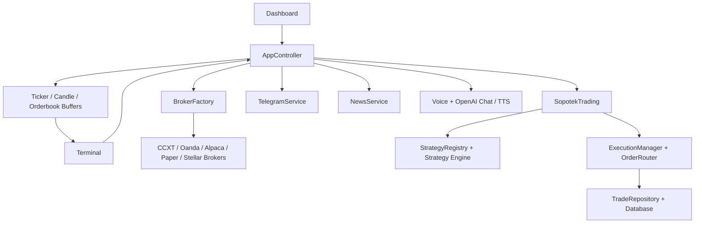

# Architecture

See also: [App UML Overview](uml/app-overview.md)

## Runtime Topology

## Main Application Layers

### UI Layer
Primary files:
- `src/frontend/ui/dashboard.py`
- `src/frontend/ui/terminal.py`
- `src/frontend/ui/chart/chart_widget.py`
- `src/frontend/ui/chart/chart_items.py`

This layer owns the desktop workflow, chart rendering, detachable windows, manual trade ticket, checklist windows, journal review windows, and operator-facing tools.

### Controller Layer
Primary file:
- `src/frontend/ui/app_controller.py`

`AppController` is the runtime coordinator. It handles login, broker bootstrapping, symbols, market-data refresh, Telegram and OpenAI integration, licensing state, settings persistence, health checks, and terminal wiring.

### Trading Core
Primary files:
- `src/core/sopotek_trading.py`
- `src/execution/execution_manager.py`
- `src/execution/order_router.py`
- `src/strategy/strategy.py`
- `src/strategy/strategy_registry.py`

This layer generates strategy decisions, routes orders, tracks order state, applies guards, and emits runtime events back toward the UI and persistence layers.

### Risk And Safety Layer
Primary files:
- `src/risk/trader_behavior_guard.py`
- `src/risk/drawdown_guard.py`
- `src/engines/risk_engine.py`

This layer applies account-level and behavior-level controls such as drawdown rules, overtrading protection, size-jump detection, and emergency trading locks.

### Broker Layer
Primary files:
- `src/broker/broker_factory.py`
- `src/broker/ccxt_broker.py`
- `src/broker/oanda_broker.py`
- `src/broker/alpaca_broker.py`
- `src/broker/paper_broker.py`
- `src/broker/stellar_broker.py`

The broker layer normalizes account, market, order, and position behavior across multiple venues.

### Data And Persistence
Primary files:
- `src/storage/database.py`
- `src/storage/trade_repository.py`
- `src/storage/market_data_repository.py`
- `src/market_data/`

This layer stores trades, manages local historical data, and keeps ticker/candle/orderbook data moving between adapters and the UI.

### Analytics And Backtesting
Primary files:
- `src/backtesting/backtest_engine.py`
- `src/backtesting/simulator.py`
- `src/backtesting/report_generator.py`
- `src/engines/performance_engine.py`

This layer supports offline evaluation, reporting, and live performance summaries.

## Data Flow

### Market Data Flow
1. Broker adapters fetch or stream candles, tickers, positions, and orderbook updates.
2. `AppController` pushes normalized data into buffers.
3. Buffers and repositories feed the terminal and chart widgets.
4. Charts render candles, news events, overlays, and orderbook heatmaps.
5. Recommendation, AI signal, and analytics windows consume the same runtime state.

### Trade Flow
1. Manual trade ticket, chart action, AI engine, or Sopotek Pilot creates a trade request.
2. `ExecutionManager` applies behavior guard and broker-aware normalization.
3. `OrderRouter` / broker adapter submits the order.
4. Order state updates are tracked and normalized.
5. Trade log, open orders, positions, journal, and analytics are refreshed.
6. Telegram notifications may be sent for trade activity.

### Integration Flow
1. Integration settings load from `QSettings`.
2. `TelegramService` long-polls when enabled.
3. Telegram messages can request status, charts, screenshots, and Sopotek Pilot answers.
4. OpenAI is used for Sopotek Pilot and optional speech output.
5. Voice input routes through the local voice service and then into Sopotek Pilot.

### Review And Discipline Flow
1. Execution updates are persisted into the trade repository.
2. Closed-journal and review windows merge broker history with local trade metadata.
3. Trade checklist, journal notes, setup tags, lessons, and review metrics stay available through `QSettings` and SQLite-backed views.
4. Sopotek Pilot can consume this review context when answering performance or behavior questions.

## Persistence Model

### SQLite
The local database stores trade-oriented runtime history and related metadata.

### QSettings
`QSettings` stores operator preferences such as:
- UI and language settings
- integration keys and toggles
- voice and speech preferences
- risk profile selection
- strategy parameters
- detached chart layouts
- last saved trade checklist state

## Architectural Notes

- `src/frontend/ui/terminal.py` and `src/frontend/ui/app_controller.py` contain most of the current behavior surface.
- The repo favors a thick desktop client with a broad orchestration controller rather than a thin UI over a separate backend service.
- The strongest evidence for real current behavior lives in the UI/controller files, execution layer, broker adapters, and tests under `src/tests/`.
