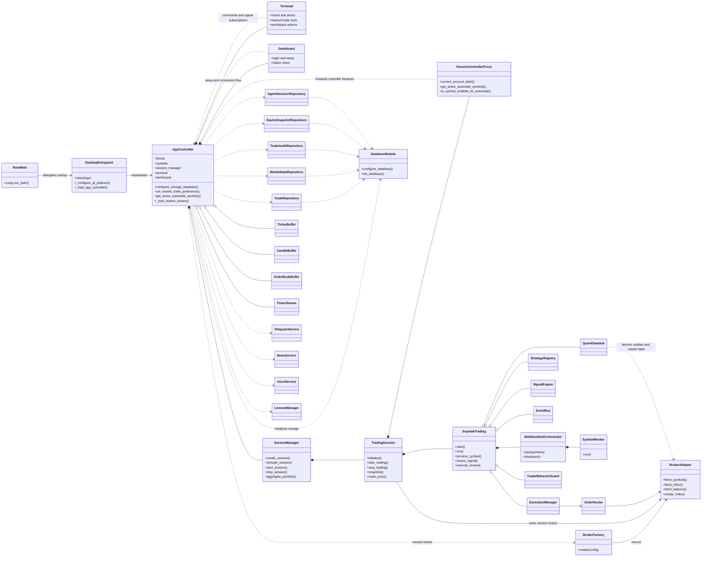
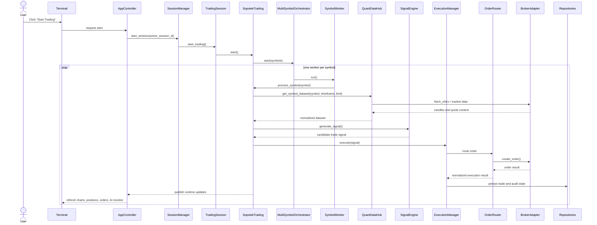

# App UML Overview

This page captures the current high-level structure of the Sopotek Quant System desktop application from the codebase as of April 5, 2026.

## UML Class Diagram

## UML Trading Sequence

## Notes

- The diagram is intentionally high-level and focuses on the main desktop runtime path.
- Broker adapters include crypto, forex, stocks, paper, options, futures, and stellar implementations selected through `BrokerFactory`.
- The session layer isolates per-broker runtime state while still reusing `AppController` behavior through `SessionControllerProxy`.
