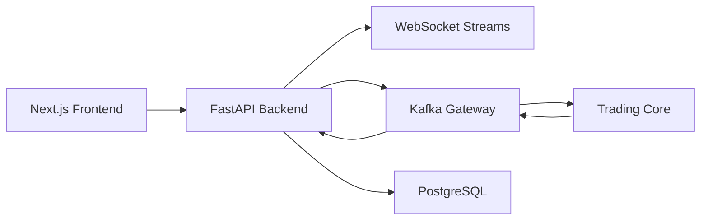

# Sopotek Quant System Web Platform

## Overview

The web platform is a SaaS-oriented control plane that complements the existing Sopotek desktop runtime. It adds:

- a Next.js multi-page trading dashboard under [`/server_app/frontend`](/Users/nguem/Documents/GitHub/sopotek_quant_system/server_app/frontend)
- a FastAPI backend under [`/server_app/backend`](/Users/nguem/Documents/GitHub/sopotek_quant_system/server_app/backend)
- Kafka topic contracts under [`/server_app/kafka/topics.yaml`](/Users/nguem/Documents/GitHub/sopotek_quant_system/server_app/kafka/topics.yaml)
- deployment orchestration under [`/server_app/docker/docker-compose.platform.yml`](/Users/nguem/Documents/GitHub/sopotek_quant_system/server_app/docker/docker-compose.platform.yml)

## Runtime Flow

## API Surface

- `POST /auth/register`
- `POST /auth/login`
- `GET /portfolio`
- `GET /positions`
- `GET /orders`
- `GET /orders/trades`
- `POST /orders`
- `GET /strategies`
- `POST /strategies`
- `PATCH /strategies/{strategy_id}`
- `GET /risk`
- `PATCH /risk`
- `POST /control/trading/start`
- `POST /control/trading/stop`
- `GET /healthz`

## WebSocket Surface

- `/ws/market`
- `/ws/portfolio`
- `/ws/executions`

All WebSocket endpoints authenticate with the same JWT used by the REST API via a `token` query parameter.

## Notes

- The backend supports an in-memory Kafka mode for local development and automated tests.
- The frontend falls back to curated desk-like mock data when no API token is configured, which keeps the UI reviewable before the backend is fully provisioned.
- The existing desktop trading runtime remains untouched; the web platform is designed to sit alongside it and consume or emit Kafka events to a trading core.
