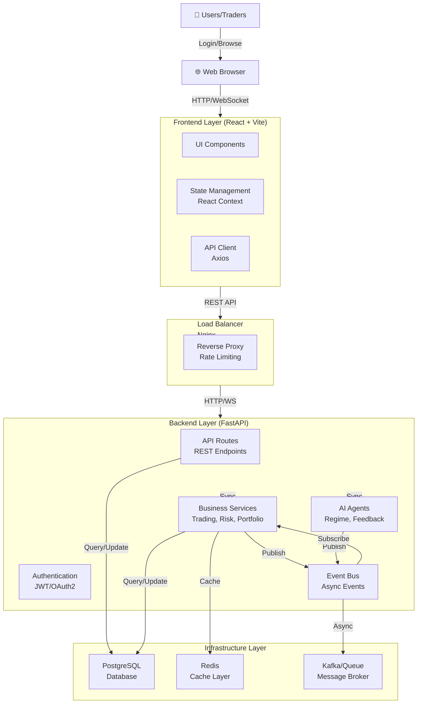
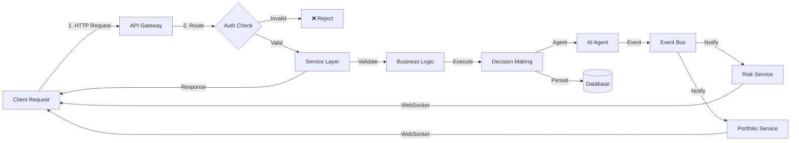
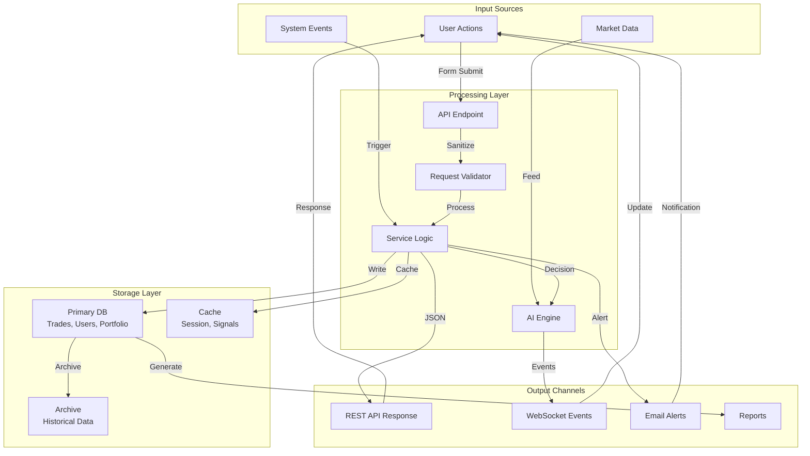
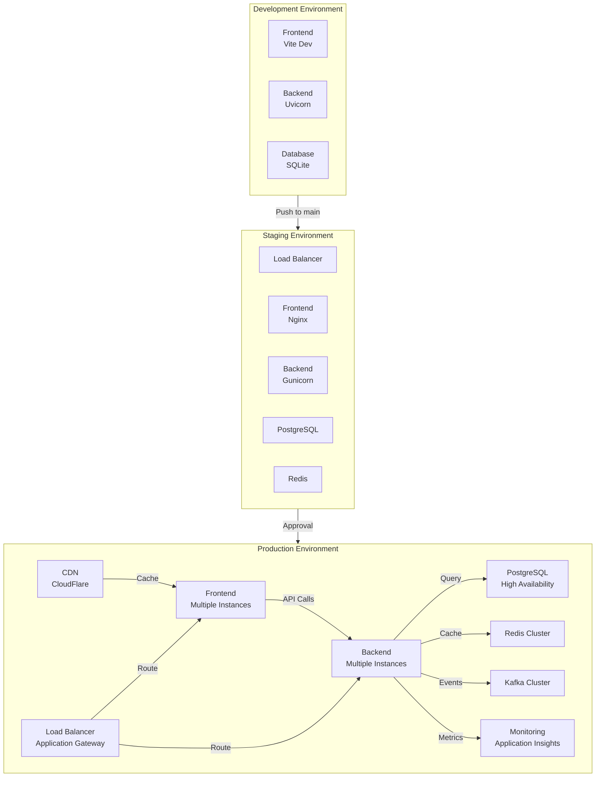
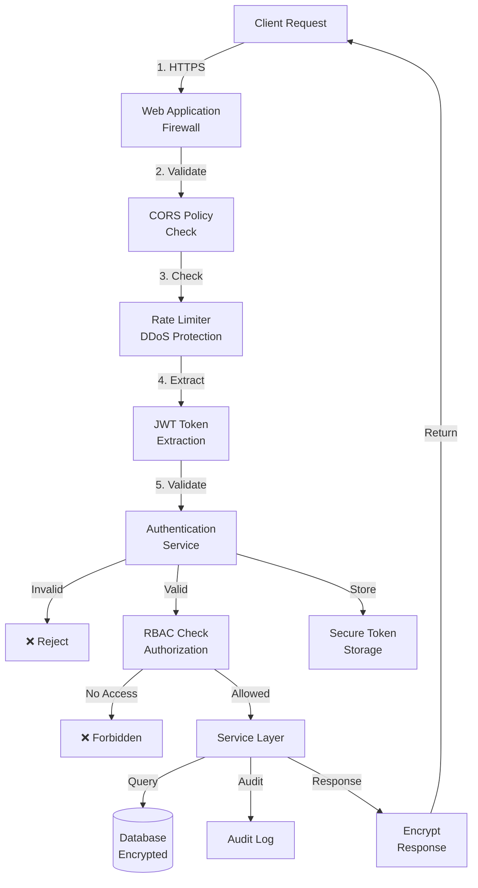
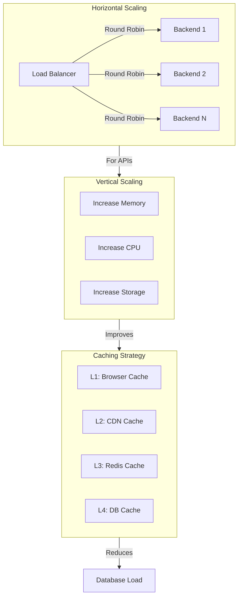
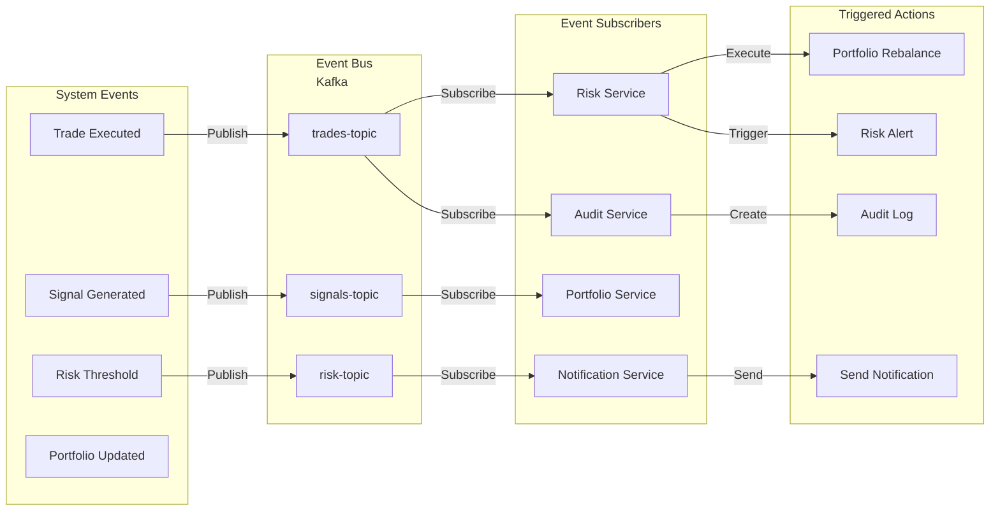

# TradeAdviser System Architecture Diagram

This document contains detailed architecture diagrams for the TradeAdviser system.

## High-Level Architecture



## Component Interaction Diagram



## Data Flow Architecture



## Database Schema Relationship

```mermaid
erDiagram
    USERS ||--o{ TRADES : places
    USERS ||--o{ PORTFOLIOS : manages
    USERS ||--o{ SIGNALS : receives
    USERS ||--o{ SESSIONS : creates
    USERS ||--o{ LICENSES : owns
    
    TRADES ||--o{ PERFORMANCE : affects
    TRADES ||--o{ AUDIT_LOG : logged_in
    
    PORTFOLIOS ||--o{ POSITIONS : contains
    PORTFOLIOS ||--o{ HOLDINGS : has
    
    SIGNALS ||--o{ TRADES : generates
    SIGNALS ||--o{ PERFORMANCE : affects
    
    AGENTS ||--o{ TRADES : recommends
    AGENTS ||--o{ SIGNALS : creates
    
    PERFORMANCE ||--o{ AUDIT_LOG : recorded_in

    USERS : int id
    USERS : string username
    USERS : string email
    USERS : string role
    USERS : datetime created_at

    TRADES : int id
    TRADES : int user_id
    TRADES : string symbol
    TRADES : decimal quantity
    TRADES : decimal price
    TRADES : string status
    TRADES : datetime executed_at

    PORTFOLIOS : int id
    PORTFOLIOS : int user_id
    PORTFOLIOS : decimal total_value
    PORTFOLIOS : decimal cash

    SIGNALS : int id
    SIGNALS : int user_id
    SIGNALS : string symbol
    SIGNALS : float strength
    SIGNALS : datetime generated_at

    PERFORMANCE : int id
    PERFORMANCE : int user_id
    PERFORMANCE : decimal roi
    PERFORMANCE : datetime period_end

    AGENTS : int id
    AGENTS : string name
    AGENTS : string type
    AGENTS : boolean enabled

    AUDIT_LOG : int id
    AUDIT_LOG : int user_id
    AUDIT_LOG : string action
    AUDIT_LOG : datetime timestamp

    LICENSES : int id
    LICENSES : int user_id
    LICENSES : string key
    LICENSES : datetime expires_at

    SESSIONS : int id
    SESSIONS : int user_id
    SESSIONS : string token
    SESSIONS : datetime expires_at

    POSITIONS : int id
    POSITIONS : int portfolio_id
    POSITIONS : string symbol
    POSITIONS : decimal quantity

    HOLDINGS : int id
    HOLDINGS : int portfolio_id
    HOLDINGS : string asset_type
    HOLDINGS : decimal amount
```

## Deployment Architecture



## Security Architecture



## Scaling Strategy



## Event Flow Architecture



---

## Architecture Decisions

### Why This Architecture?

1. **Separation of Concerns**: Frontend, API, Business Logic, and Data Access are clearly separated
2. **Scalability**: Stateless services can be scaled horizontally
3. **Maintainability**: Clear module boundaries and responsibilities
4. **Testability**: Each layer can be tested independently
5. **Performance**: Caching and async processing optimize throughput
6. **Security**: Multiple layers of security (WAF, CORS, RBAC, encryption)
7. **Reliability**: Load balancing, redundancy, and failover capabilities

### Technology Choices

| Component | Technology | Reason |
|-----------|-----------|--------|
| Frontend | React + Vite | Modern, fast build tool, great DX |
| Backend | FastAPI | High performance, async support, auto docs |
| Database | PostgreSQL | Robust ACID compliance, JSON support |
| Cache | Redis | High performance, many data structures |
| Queue | Kafka | Distributed, fault-tolerant event streaming |
| Container | Docker | Consistency across environments |
| Reverse Proxy | Nginx | High performance, flexible routing |

---

**Last Updated**: April 2026
